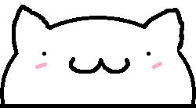

# OpenBongo - Bongo Cat Desktop Widget

<div align="center">
  
</div>

<div align="center">
  <a href="https://discord.gg/TVw6h5TBqJ" style="display: inline-block; background-color: #5865F2; color: white; padding: 12px 24px; text-decoration: none; border-radius: 4px; font-weight: bold; font-size: 12px; margin: 20px 0; box-shadow: 0 4px 6px rgba(0,0,0,0.1);">
    <svg width="14.4" height="14.4" viewBox="0 0 24 24" fill="white" style="vertical-align: middle; margin-right: 6px; display: inline-block;">
      <path d="M20.317 4.37a19.791 19.791 0 0 0-4.885-1.515a.074.074 0 0 0-.079.037c-.21.375-.444.864-.608 1.25a18.27 18.27 0 0 0-5.487 0a12.64 12.64 0 0 0-.617-1.25a.077.077 0 0 0-.079-.037A19.736 19.736 0 0 0 3.677 4.37a.07.07 0 0 0-.032.027C.533 9.046-.32 13.58.099 18.057a.082.082 0 0 0 .031.057a19.9 19.9 0 0 0 5.993 3.03a.078.078 0 0 0 .084-.028a14.09 14.09 0 0 0 1.226-1.994a.076.076 0 0 0-.041-.106a13.107 13.107 0 0 1-1.872-.892a.077.077 0 0 1-.008-.128a10.2 10.2 0 0 0 .372-.292a.074.074 0 0 1 .077-.01c3.928 1.793 8.18 1.793 12.062 0a.074.074 0 0 1 .078.01c.12.098.246.198.373.292a.077.077 0 0 1-.006.127a12.299 12.299 0 0 1-1.873.892a.077.077 0 0 0-.041.107c.36.698.772 1.362 1.225 1.993a.076.076 0 0 0 .084.028a19.839 19.839 0 0 0 6.002-3.03a.077.077 0 0 0 .032-.054c.5-5.177-.838-9.674-3.549-13.66a.061.061 0 0 0-.031-.03zM8.02 15.33c-1.183 0-2.157-1.085-2.157-2.419c0-1.333.956-2.419 2.157-2.419c1.21 0 2.176 1.096 2.157 2.42c0 1.333-.956 2.418-2.157 2.418zm7.975 0c-1.183 0-2.157-1.085-2.157-2.419c0-1.333.955-2.419 2.157-2.419c1.21 0 2.176 1.096 2.157 2.42c0 1.333-.946 2.418-2.157 2.418z"/>
    </svg>
    <span style="vertical-align: middle;">Join Discord</span>
  </a>
</div>

A desktop widget inspired by the Bongo Cat Steam game. The cat reacts to your keyboard presses by punching the taskbar/desktop.

# NOTE: MACOS SUPPORT THEORETICALLY WORKS BUT IT HAS NOT BEEN COMPILED OR TESTED YET

## Features

- 🐱 Simple Bongo Cat widget (currently using placeholder shapes)
- ⌨️ Global keyboard hook - reacts to all key presses
- 🖱️ Click to trigger animation
- 🪟 Always-on-top window
- 🎨 Easy to replace with custom art later

## Building

### Prerequisites

- CMake 3.15 or higher
- C++17 compatible compiler
- SFML 2.5 or higher

#### macOS
```bash
brew install sfml
```

### Building the Project

```bash
mkdir build
cd build
cmake ..
cmake --build .
```

### Running

#### Windows
Run `OpenBongo.exe` from the build directory.

#### macOS
You may need to grant accessibility permissions:
1. Go to System Preferences → Security & Privacy → Privacy → Accessibility
2. Add Terminal (or your IDE) to the allowed apps
3. Run the application

## Current Implementation

- **Body**: Square shape (will be replaced with art)
- **Arms**: Rectangle shapes (will be replaced with art)
- **Animation**: Arms move down when keys are pressed
- **Window**: Small, always-on-top, draggable window

## Future Enhancements

- Replace developer art
- Add multiplayer
- Add more animations
- Add configuration options
- Add sound effects

## License

This project is open source and available for modification under the MIT License.

